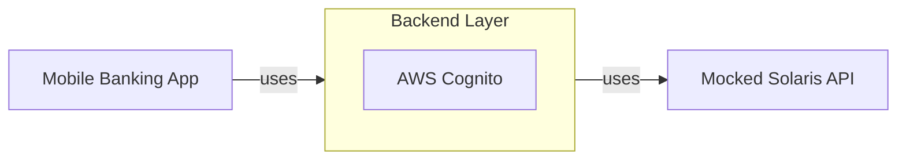

# Solaris Demo Application

A proof-of-concept mobile-banking application that uses a [Solaris](https://docs.solarisgroup.com/api-reference/)_-like_ BE API.

## General architecture overview

The Mobile bank application is built with Flutter and can be deployed on both iOS and Android devices.

The Mobile application connects to a backend layer that connects to a [mock-solaris](https://github.com/kontist/mock-solaris).instance. AWS Cognito is used on the backend middle layer to authenticate and differentiate users.

Environment variables can be set by copying `.env.example` to `.env` _(in root folder)_ and adding the values to the varibles.

## Scope

The application already includes the following features:
- Email + password login
- User dashboard / landing page
- Transactions list
- Send money to a person

|  
|  
|  
|  
|  |

The following features are planned to be implemented:
1. Physical card details
1. Filter & sort transactions
1. Account details
1. Top up
1. Transaction details
1. Search through transactions
1. Physical card - deactivate
1. Physical card - set card PIN
1. Physical card - Freeze / Unfreeze
1. Send money to a saved payee
1. Sign UP

## Contact

For any questions, guidance or other interests _(like building projects or getting hired)_ contact [Thinslices](https://www.thinslices.com/contact).
