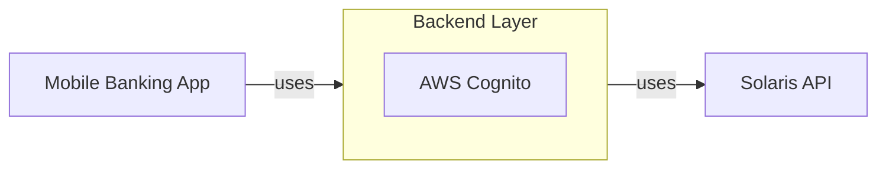

# Ivory Demo Application

A proof-of-concept mobile-banking application that uses [Solaris API](https://docs.solarisgroup.com/api-reference/).

## General architecture overview

The Mobile bank application is built with Flutter and can be deployed on both iOS and Android devices.

The Mobile application connects to a backend layer that connects to a [Solaris API](https://docs.solarisgroup.com/api-reference/). AWS Cognito is used on the backend middle layer to authenticate and differentiate users.

Environment variables can be set by copying `.env.example` to `.env` _(in root folder)_ and adding the values to the varibles.

## Scope

The application already includes the following features:

- Sign-up
- Email + password login
- User dashboard / landing page
- Transactions list
- Send money to a person
- Physical card details
- Filter & sort transactions
- Transaction details
- Search through transactions
- Physical card - deactivate
- Physical card - set card PIN
- Physical card - Freeze / Unfreeze

We are currently working on converting and developing the app into a revolving credit card app with features such as:

- Credit card onboarding
- Credit card operations (activate/deactivate, freeze/unfreeze, PIN change, viewing details, etc.)
- Credit card transactions (filtering, sorting, searching, upcoming transactions, etc.)
- Credit card payments (3DS, Apple wallet)
- Repayments

## Product prototype

https://github.com/ivoryio/SolarisDemoApp/assets/16954041/4963f20b-856b-4364-8c5f-653ada6a3733

Find more details [here](https://www.thinslices.com/ivory-banking-app).

You can find the prototype [here](https://www.figma.com/proto/XReOTW8hCzSSTPsfqWhwy6/Ivory---Demo-App?page-id=1086%3A72864&type=design&node-id=1221-101377&viewport=-1964%2C1794%2C0.19&t=XEC1Fu5v6GR6h7B3-1&scaling=contain&starting-point-node-id=1221%3A101373).

## Contact

For any questions, guidance or other interests _(like building projects or getting hired)_ contact [Thinslices](https://www.thinslices.com/contact).
